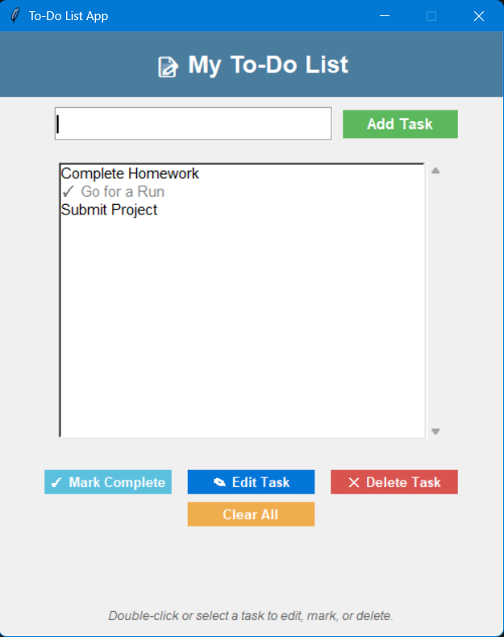

# 📝 To-Do List App (Tkinter)

A simple, elegant **To-Do List** desktop application built using **Python’s Tkinter GUI library**.  
It lets you easily manage daily tasks — add, edit, delete, mark complete, and save them automatically between sessions.

---

## 🚀 Features

✅ Add new tasks easily  
✅ Edit existing tasks in one click  
✅ Mark tasks as complete (adds a ✓ checkmark)  
✅ Delete selected tasks  
✅ Clear all tasks instantly  
✅ Auto-save to `tasks.json` (tasks persist after closing the app)  
✅ Clean, modern Tkinter UI with styled buttons and frames  

---

## 🖼️ Preview

> ```
> 
> ```

---

## 🧰 Tech Stack

- **Language:** Python3  
- **GUI Library:** Tkinter (built-in with Python)  
- **Data Storage:** JSON (for saving task list)

---

## ⚙️ Setup Instructions

### 1️⃣ Clone the repository
```bash
git clone https://github.com/<your-username>/To-Do-List.git
cd To-Do-List
```
### 2️⃣ Run the app
Run the Python script:

```bash
python todolist.py
```

(Or whatever your main file name is — e.g. main.py)

---

## 📂 Project Structure
```bash
To-Do-List/
├── todo.py          # Main Tkinter app
├── tasks.json       # Auto-saved task data
├── README.md        # Documentation
└── .gitignore       # Optional - ignores cache/editor files
```

---

## Working
- When you launch the app, it automatically loads tasks from tasks.json.
- Every time you add, delete, mark, clear, or edit a task — it saves instantly.
- Completed tasks appear gray with a ✓ checkmark.
- Data is stored locally; no internet connection required.

---

## 🛠️ Optional Improvements
Here are some ideas you can try next:
- Add due dates or priorities
- Sort tasks by completion or creation time
- Add “Save As” or export to text/CSV
- Add a dark mode theme
- Add reminders or notifications

---

## 🧑‍💻 Author
- Pranav M S Krishnan
- [Visit my GitHub Profile](https://github.com/Pranav-MSK)

💬 Contributions, suggestions, and stars ⭐ are always welcome!
